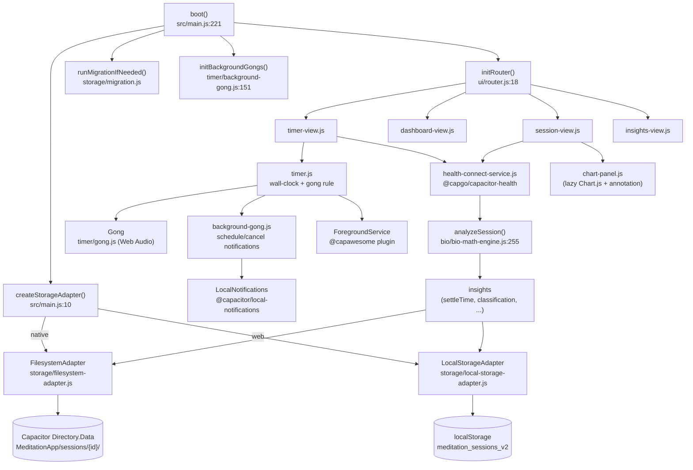
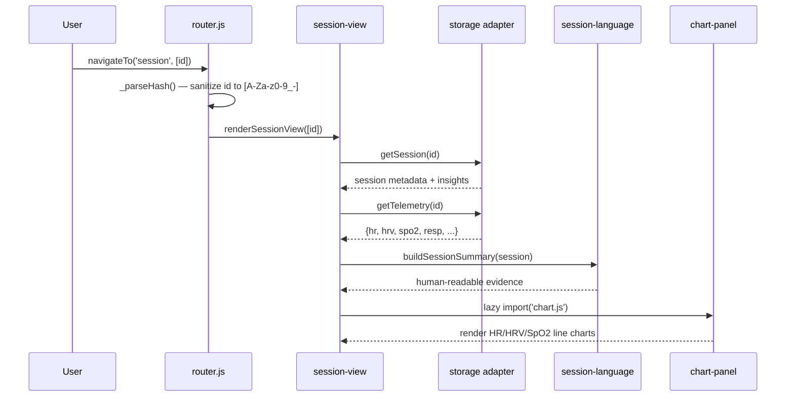

<!-- last-reviewed: 2026-05-05 -->
<!-- sections: llm-bootstrap, features, architecture, components, code-map, data-flow, decisions, data-structures, extension-points, dependencies, operations, glossary, workflow -->

# Meditation Timer — System Overview

A living reference for both humans and future LLM sessions. Read **LLM Bootstrap** first if you're about to modify code; read **What It Does** first if you're a new contributor or stakeholder.

> **HTML viewer:** open `docs/system-overview.html` in any browser to see the diagrams rendered (the markdown is the source of truth; the HTML is a generated view).

---

## LLM Bootstrap {#llm-bootstrap}
<!-- last-verified: 2026-05-05 -->

**What this project is in one line:** A PWA meditation timer wrapped by Capacitor for Android, with wall-clock-accurate gongs (foreground Web Audio + background-scheduled local notifications), platform-conditional local session storage, and optional Health Connect bio telemetry that gets analyzed into per-session insights.

**Invariants that must not break** (each pinned to live code):

- **Wall-clock elapsed time** — never count `setInterval` ticks; recompute from `Date.now() - _resumeWallTime + _accumulatedBeforePause`. Survives Android Doze / iOS background throttling. ([src/timer/timer.js:57–61](../src/timer/timer.js))
- **Gong rule** — `t === 15` → 1 strike; `t > 0 && t % intervalSec === 0` → `t / intervalSec` strikes. Same rule applies in foreground (Web Audio) and background (notification scheduling). ([src/timer/timer.js:64–72](../src/timer/timer.js), [src/timer/background-gong.js:179–200](../src/timer/background-gong.js))
- **Notification channels MUST exist before scheduling.** Android 8+ silently drops notifications referencing a missing channel — alarm fires, nothing displays, no sound. `_ensureChannels()` runs at boot AND inline before every `scheduleBackgroundGongs()`. ([src/timer/background-gong.js:108–145](../src/timer/background-gong.js), [src/timer/background-gong.js:219–221](../src/timer/background-gong.js))
- **Foreground service is coupled to timer state.** `startTimer()` starts it; `pauseTimer()` and `finishTimer()` stop it. Without it, Doze can kill the WebView and orphan scheduled notifications. ([src/timer/timer.js:84,112,124](../src/timer/timer.js), [src/timer/background-gong.js:282–305](../src/timer/background-gong.js))
- **On `visibilitychange:visible`, cancel-then-reschedule.** Notifications already played gongs that fired while backgrounded — do NOT call `_checkGongs()` on resume. ([src/timer/timer.js:149–163](../src/timer/timer.js))
- **Storage adapter selected by platform.** `Capacitor.isNativePlatform()` → `FilesystemAdapter`; otherwise `LocalStorageAdapter`. Mock adapter is for tests only. ([src/main.js:10–15](../src/main.js))
- **Session schema is v2.** `schemaVersion: 2`. Migration from v1 (`meditation_history` localStorage key) runs once, gated by `MIGRATION_FLAG = 'meditation_migration_v6_complete'`. Don't re-run; don't break the gate. ([src/storage/migration.js:5,22](../src/storage/migration.js))
- **Session IDs are sanitized at the storage boundary.** `_validateId()` rejects anything outside `[A-Za-z0-9_-]+` to prevent path traversal in the filesystem adapter. ([src/storage/filesystem-adapter.js:14–18](../src/storage/filesystem-adapter.js))
- **Router params are sanitized to `[A-Za-z0-9_-]`.** Defense in depth against hash-XSS. ([src/ui/router.js:33](../src/ui/router.js))
- **`escapeHtml()` is the only safe path for user data into HTML.** ([src/utils/escape-html.js:1–9](../src/utils/escape-html.js))
- **`APP_VERSION` is manually bumped; `CACHE_NAME` is auto-bumped at build.** The `swCacheBuster` Vite plugin rewrites `CACHE_NAME` in the built `www/service-worker.js` to `meditation-timer-<sha256(index.html)[:10]>` after every `vite build`. The literal `'meditation-timer-v47'` in the source file is a placeholder that the build overwrites. ([src/main.js:28](../src/main.js), [public/service-worker.js:3](../public/service-worker.js), [vite.config.js:6–27](../vite.config.js))

**Entry points:**

- Web dev: `npm run dev` → Vite on port `8080` → [src/main.js](../src/main.js) (note: the dev server config in [vite.config.js:36–38](../vite.config.js) overrides Vite's default 5173 — the value in CLAUDE.md is stale)
- Web preview: `npm run build && npm run preview` (preview defaults to `4173`)
- Tests: `npm test` (Vitest, 11 test files, ~151 tests)
- Android emulator: `./run.sh` (manages AVD lifecycle, persistent Gradle home in `.gradle-home/`)
- Android phone: `./deploy-phone.sh` (interactive `adb` device picker)

**If you're modifying X, start at Y:** see the [Code Map](#code-map).

**Non-goals:**

- iOS native build path (the `@capacitor/ios` dev dep is present but no run script; only Android is wired end-to-end)
- Cloud sync, accounts, or multi-user — everything is on-device
- Generic fitness tracking — the bio analytics are tuned for meditative HR/respiration profiles (settle time, breathlessness, torpor)
- Custom Android plugin code — `android/app/src/main/java/` is empty; all native capability comes from external Capacitor plugins

---

## What It Does {#features}
<!-- last-verified: 2026-05-05 -->

A focused, offline-first meditation timer that strikes a metallic gong on a configurable cadence (default every 15 minutes, with a "settling" gong at 15s), keeps timing accurate across screen lock and background, and — when the user opts in to Android Health Connect — records HR / HRV / SpO2 / respiration during the session and turns it into a one-screen reflection.

- **Start a meditation timer** with audible gongs that survive screen lock and Android Doze.
- **Get a settling gong at 15 seconds** to mark the start of stillness, plus interval gongs at every 15-minute mark (or 5-minute in dev mode).
- **Read a per-session detail page** with HR/HRV/SpO2 line charts, settle time, classification (`somnolent`/`deep_absorption`/`absorbed`/`settling`/`restless`), and one-line evidence ("Settled in 3m", "Heart rate remained elevated").
- **See longitudinal stats**: streak, weekly/monthly totals, 30-day duration bar chart, settle-time trend.
- **Use it offline** as a PWA on web, or installed natively on Android via Capacitor with cached app shell + service worker.

---

## Architecture Overview {#architecture}
<!-- last-verified: 2026-05-05 -->

The system is a thin browser app boot path that loads platform-conditional storage and a router, then mounts four views. Two cross-cutting subsystems handle the hard parts: timing+gongs (foreground audio + background notifications + foreground service) and bio (Health Connect query → pure-function math → insights).



The two architectural choices visible in this diagram: **storage is swapped at boot** behind a single `DataStorageInterface` contract, so the rest of the app never knows whether it's writing localStorage JSON or per-session files; and **gongs run on two independent rails** (Web Audio when foreground, scheduled local notifications when backgrounded), with `visibilitychange` orchestrating the handoff so neither plays the same gong twice and neither misses one. The bio pipeline is deliberately one-way and stateless — Health Connect → pure math → store insights inside the session record, with no caching or back-references.

---

## Component Inventory {#components}
<!-- last-verified: 2026-05-05 -->

| Component | Owns / Responsible for | Does NOT own |
|---|---|---|
| [src/main.js](../src/main.js) | App boot, storage adapter selection, version footer, dev panel, service worker registration, `window.meditationDebug` | Any business logic — pure orchestration |
| [src/timer/timer.js](../src/timer/timer.js) | Wall-clock elapsed time, gong rule evaluation in foreground, visibility handoff to background scheduler, foreground-service lifecycle, session save callback | Audio synthesis, notification scheduling, persistence |
| [src/timer/gong.js](../src/timer/gong.js) | Web Audio additive synthesis, multi-strike pacing (7s gap) | Anything notification-related, when-to-play logic |
| [src/timer/background-gong.js](../src/timer/background-gong.js) | Notification channel lifecycle, schedule computation (`computeGongSchedule`), schedule/cancel calls, foreground-service start/stop, exact-alarm permission helpers, on-device diagnostic log | Foreground audio, timer state, UI |
| [src/storage/storage-interface.js](../src/storage/storage-interface.js) | Abstract contract: `initialize`, `saveSession`, `getSession`, `getAllSessions`, `saveTelemetry`, `getTelemetry`, `deleteSession` | Any concrete I/O |
| [src/storage/local-storage-adapter.js](../src/storage/local-storage-adapter.js) | Web persistence in `meditation_sessions_v2`, per-session `meditation_telemetry_{id}`, 250-session LRU cap | Native filesystem, migration |
| [src/storage/filesystem-adapter.js](../src/storage/filesystem-adapter.js) | Native persistence under `Directory.Data/MeditationApp/sessions/{id}/{metadata,telemetry}.json`, ID validation, index cache | Web localStorage, migration |
| [src/storage/mock-adapter.js](../src/storage/mock-adapter.js) | In-memory store for tests / demo | Persistence |
| [src/storage/migration.js](../src/storage/migration.js) | One-shot v1→v2 conversion, gated by `MIGRATION_FLAG` | The schema definition itself (lives in writers) |
| [src/bio/bio-math-engine.js](../src/bio/bio-math-engine.js) | Stateless analysis: settle time, RMSSD, RSA respiration extraction, skin-temp trend, torpor detection, classification, `analyzeSession` orchestrator | Data fetching, persistence, UI |
| [src/bio/health-connect-service.js](../src/bio/health-connect-service.js) | HC availability/permission/query/seed via `@capgo/capacitor-health`, normalized telemetry shape | Analysis, persistence |
| [src/bio/mock-data.js](../src/bio/mock-data.js) | Synthetic profiles (`PROFILE_RESTLESS`, `PROFILE_DEEP`, `PROFILE_SOMNOLENT`) for dev/tests | Real data |
| [src/ui/router.js](../src/ui/router.js) | Hash-based view selection, param sanitization, view show/hide, tab-bar active state | View rendering, data |
| [src/ui/views/](../src/ui/views/) | Per-view DOM mount + render functions (`mount*` once, `render*` per navigation) | Domain logic, persistence |
| [src/ui/components/tab-bar.js](../src/ui/components/tab-bar.js) | Bottom-nav tabs, dispatches `navigateTo()` | Routing internals |
| [src/ui/components/chart-panel.js](../src/ui/components/chart-panel.js) | Lazy-load Chart.js + annotation plugin + date adapter; chart config builders | Data, layout |
| [src/ui/session-language.js](../src/ui/session-language.js) | Translates raw insights into human-readable summaries / evidence phrases | Computing the insights |
| [src/utils/](../src/utils/) | `date-helpers` (formatting, streaks, week math), `csv` (parse/serialize), `escape-html` (XSS-safe entities) | Anything domain-specific |
| [public/service-worker.js](../public/service-worker.js) | Offline cache: pre-cache app shell, cache-first for same-origin fetches, version-keyed cache cleanup on activate | Anything app-level |

---

## Code Map {#code-map}
<!-- last-verified: 2026-05-05 -->

The single most useful section if you're about to make a change. Each row names the *intent* a contributor actually has and points at the files to touch.

| If you want to... | Start here | Then probably also touch |
|---|---|---|
| Change the gong cadence (interval, settling-gong time) | [src/timer/timer.js:64–72](../src/timer/timer.js) (`_checkGongs`), [src/timer/background-gong.js:179–200](../src/timer/background-gong.js) (`computeGongSchedule`) — the foreground and background rules MUST stay identical | [src/timer/background-gong.js:44–55](../src/timer/background-gong.js) (interval helpers); [src/timer/background-gong.test.js](../src/timer/background-gong.test.js) and [src/timer/timer.test.js](../src/timer/timer.test.js) |
| Change the audible gong sound | [src/timer/gong.js:18–43](../src/timer/gong.js) (foreground synthesis) AND `android/app/src/main/res/raw/gong.wav` (background notification sound — channel `gong` references it) |  |
| Add or change a storage backend | Implement `DataStorageInterface` from [src/storage/storage-interface.js](../src/storage/storage-interface.js); register selection in [src/main.js:10–15](../src/main.js) | [src/storage/migration.js](../src/storage/migration.js) if persisted shape changes |
| Bump the session schema | [src/storage/migration.js:22](../src/storage/migration.js) (raise `schemaVersion`), add a new migration step, and bump `MIGRATION_FLAG` ([line 5](../src/storage/migration.js)) so it re-runs once | All three adapters' `saveSession`; tests in [src/storage/migration.test.js](../src/storage/migration.test.js) |
| Add a new bio metric | [src/bio/health-connect-service.js:7](../src/bio/health-connect-service.js) (`HC_READ_TYPES` + `querySession` mapping); [src/bio/bio-math-engine.js:255](../src/bio/bio-math-engine.js) (`analyzeSession`); [src/ui/views/session-view.js](../src/ui/views/session-view.js) for chart + summary; tests in [src/bio/bio-math-engine.test.js](../src/bio/bio-math-engine.test.js) | `android/app/src/main/AndroidManifest.xml` if a new HC permission is needed |
| Add a new view / route | [src/ui/router.js:4–9](../src/ui/router.js) (`VIEW_IDS`); add a `view-<name>` element in `index.html`; create `src/ui/views/<name>-view.js` with `mount*`/`render*`; mount in [src/main.js:238–249](../src/main.js); add tab in [src/ui/components/tab-bar.js](../src/ui/components/tab-bar.js) if user-facing |  |
| Change the cache strategy | [public/service-worker.js](../public/service-worker.js) — `swCacheBuster` will auto-rewrite `CACHE_NAME` on next `vite build` ([vite.config.js:6–27](../vite.config.js)) | Bump `APP_VERSION` in [src/main.js:28](../src/main.js) for the visible footer |
| Bump the visible UI version | [src/main.js:28](../src/main.js) (`APP_VERSION`) — that's all; service-worker cache name is auto-rebuilt |  |
| Add an Android permission | `android/app/src/main/AndroidManifest.xml`; rebuild via `./run.sh` or `./deploy-phone.sh` (no `--skip-build`) |  |
| Mock telemetry / demo a session | `meditationDebug.simulateBioSession('deep'\|'restless'\|'somnolent')` from console — wired in [src/main.js:283–286](../src/main.js); profiles in [src/bio/mock-data.js](../src/bio/mock-data.js) |  |
| Add or change an XSS-safe rendering path | Use [src/utils/escape-html.js](../src/utils/escape-html.js) at the call site; do not write raw `innerHTML` for user data |  |

---

## Data Flow {#data-flow}
<!-- last-verified: 2026-05-05 -->

### Journey 1 — Active session with foreground + background gongs

```mermaid
sequenceDiagram
    participant U as User
    participant TV as timer-view
    participant T as timer.js
    participant G as Gong (Web Audio)
    participant BG as background-gong.js
    participant LN as LocalNotifications<br/>(@capacitor)
    participant FGS as ForegroundService

    U->>TV: tap Start
    TV->>T: startTimer()
    T->>G: gong.init() (user-gesture unlock)
    T->>FGS: startMeditationForegroundService()
    T->>BG: scheduleBackgroundGongs(0, 'startTimer')
    BG->>BG: _ensureChannels()
    BG->>LN: schedule(notifications)
    Note over T,G: setInterval(1s) — wall-clock _syncElapsed()
    T->>G: play(N) at t=15, t=interval, ...

    U->>U: locks screen
    Note over T: visibilitychange: hidden
    T->>T: handleVisibilityHidden() — sync only

    Note over LN,FGS: alarms fire while backgrounded;<br/>notifications display + sound

    U->>U: unlocks screen
    Note over T: visibilitychange: visible
    T->>BG: cancelBackgroundGongs('visibilityResume')
    T->>BG: scheduleBackgroundGongs(elapsed, 'visibilityResume')
    Note over T: do NOT _checkGongs() — notifs already played

    U->>TV: tap Finish
    TV->>T: finishTimer()
    T->>BG: cancelBackgroundGongs('finishTimer')
    T->>FGS: stopMeditationForegroundService()
    T-->>TV: onSessionSave({duration, start, end})
```

The whole architecture exists to keep gongs reliable when the screen is off. Two rails — foreground Web Audio and scheduled local notifications — would double-play if both ran simultaneously, so `visibilitychange` is the explicit handoff: when hidden, only the notifications fire; when visible again, the timer cancels remaining notifications and resumes Web Audio without replaying gongs the user already heard. The acknowledged limitation: Android's `setExactAndAllowWhileIdle()` throttles to ~9 minutes per app in Doze, so multi-strike gongs (e.g., 2 strikes 7s apart) may only deliver the first while backgrounded ([src/timer/background-gong.js:16–19](../src/timer/background-gong.js)).

### Journey 2 — Session detail rendering



The render path is deliberately serial and side-effect-free apart from chart mounting. Chart.js is imported on first use only ([src/ui/components/chart-panel.js](../src/ui/components/chart-panel.js)), so the timer view stays light. The router's regex-stripped `id` ([src/ui/router.js:33](../src/ui/router.js)) is the same shape the filesystem adapter validates ([src/storage/filesystem-adapter.js:14–18](../src/storage/filesystem-adapter.js)) — defense in depth across two layers.

---

## Key Design Decisions {#decisions}
<!-- last-verified: 2026-05-05 -->

**1. Wall-clock elapsed time, not interval-tick counting** *(established before v9)*
`setInterval` callbacks are throttled or paused when a tab/app backgrounds. Recomputing elapsed from `Date.now() - _resumeWallTime` keeps the displayed timer accurate even after a 30-minute screen lock. Cost: tick-skip handling in `_checkGongs(prev, curr)` to fire gongs for any seconds that were skipped. ([src/timer/timer.js:57–72](../src/timer/timer.js))

**2. Two-rail gongs with visibility handoff** *(v8 rewrite)*
Foreground = Web Audio (low latency, reliable while focused). Background = local notifications scheduled in advance (Doze-safe; alarms fire even with the WebView paused). On `visibilitychange`, we cancel the unfired notifications and reschedule from current elapsed; on hide, we don't reschedule (Android suspends the WebView mid-`schedule()` call). ([src/timer/timer.js:149–177](../src/timer/timer.js), [src/timer/background-gong.js:1–22](../src/timer/background-gong.js))

**3. Channel pre-creation as a hard precondition** *(Android 8+ requirement)*
A notification referencing a missing channel is silently dropped — no error, no display, no sound. `_ensureChannels()` runs at boot AND inline before each schedule, with a 5s timeout and a `localStorage` flag so we don't repeat the work. ([src/timer/background-gong.js:104–145](../src/timer/background-gong.js))

**4. v2 schema with one-shot migration flag** *(v6 migration)*
v1 stored only `{id, date, duration, type}` in `meditation_history`. The v2 schema adds `startTimestamp`, `insights`, `hasTelemetry`, `schemaVersion`. Migration runs once gated by `MIGRATION_FLAG`; v1 sessions are tagged `migratedFromV1: true` with `startTimestamp: null`. ([src/storage/migration.js:5,22](../src/storage/migration.js))

**5. Storage swapped at boot behind one contract**
`DataStorageInterface` is the single contract. Web → `LocalStorageAdapter` (in-memory cache, 250-session LRU). Native → `FilesystemAdapter` (per-session directory under `Directory.Data/MeditationApp/`). The rest of the app is platform-agnostic. ([src/storage/storage-interface.js](../src/storage/storage-interface.js), [src/main.js:10–15](../src/main.js))

**6. Stateless bio math, side-effect-free**
`bio-math-engine.js` has no DOM access, no storage, no fetches. Every function takes telemetry in and returns insights out. This is what makes 151 tests cheap to run and what lets `meditationDebug.simulateBioSession()` exist as a one-liner. ([src/bio/bio-math-engine.js:1–14](../src/bio/bio-math-engine.js))

**7. `swCacheBuster` Vite plugin auto-bumps the SW cache name** *(removes a manual-discipline trap)*
Old workflow required hand-editing `CACHE_NAME` on every UI change or risk stale-cache bugs. The build plugin now hashes `index.html` and rewrites `CACHE_NAME` to `meditation-timer-<sha256[:10]>` after every `vite build`. The literal value in the source file is just a placeholder. ([vite.config.js:6–27](../vite.config.js))

**8. Hash-route param whitelist + storage-layer ID validation** *(defense in depth)*
Both `router.js` and `filesystem-adapter.js` independently restrict IDs to `[A-Za-z0-9_-]`. Either alone would be enough; both together mean a bug in one doesn't open a hole. ([src/ui/router.js:33](../src/ui/router.js), [src/storage/filesystem-adapter.js:14–18](../src/storage/filesystem-adapter.js))

---

## Key Data Structures {#data-structures}
<!-- last-verified: 2026-05-05 -->

### v2 Session record (persisted by all adapters)

```js
{
  id:               "ses_<timestamp>",   // [A-Za-z0-9_-]+ enforced at storage boundary
  startTimestamp:   "2026-04-26T10:30:00.000Z",  // ISO; null for v1-migrated sessions
  endTimestamp:     "2026-04-26T11:15:00.000Z",
  duration:         2700,                // seconds
  hasTelemetry:     true,                // flipped by saveTelemetry()
  insights:         { ... },             // see below; null if no telemetry
  type:             "meditation",
  schemaVersion:    2,
  // optional, set by HC seed flow:
  telemetrySource:  "health_connect" | "mock",
  telemetryReason:  "string",
  // optional, set by migration:
  migratedFromV1:   true,
}
```

### Telemetry shape returned by `health-connect-service.querySession()`

```js
{
  hr:   [{ timestamp: ISO, value: bpm }, ...],
  hrv:  [{ timestamp: ISO, value: ms_RMSSD }, ...],   // sparse, ~1 per 5 min from HC
  spo2: [{ timestamp: ISO, value: pct }, ...],
  resp: [{ timestamp: ISO, value: br_per_min }, ...], // direct from HC; preferred over RSA
  temp: [],                                            // not exposed by current plugin
  source: "health_connect"
}
```

### Insights object emitted by `analyzeSession()`

```js
{
  settleTime:        { seconds, timestamp } | null,         // 5%-band-for-60s rule
  avgHR:             number,
  respirationRate:   { average, breathlessPeriodsCount, source, confidence, warning? },
  skinTemp:          { delta, trend: 'rising'|'falling'|'flat' } | null,
  spo2:              { torpidFlag, ... },
  sessionQuality:    'restless'|'settling'|'absorbed'|'deep_absorption'|'somnolent',
}
```

Classification priority (highest wins): `somnolent` (torpid SpO2) > `deep_absorption` (breathless+rising temp) > `absorbed` (settle <300s) > `settling` (settle >=300s) > `restless`. ([src/bio/bio-math-engine.js:228–241](../src/bio/bio-math-engine.js))

### Background gong notification entry

```js
{
  id:        number,         // 1-based, monotonic per schedule
  fireAt:    Date,           // wall-clock fire time (allowWhileIdle: true)
  // assembled in scheduleBackgroundGongs():
  title:     "Meditation",
  body:      "Gong #<id>",
  channelId: "gong" | "gong_diag",   // CHANNEL_ID_GONG or CHANNEL_ID_DEFAULT
  sound:     "gong" | undefined,     // omitted when using system chime
  smallIcon: "ic_launcher_foreground",
  autoCancel: true,
}
```

---

## Extension Points {#extension-points}
<!-- last-verified: 2026-05-05 -->

- **New storage backend** — Implement every method on `DataStorageInterface` from [src/storage/storage-interface.js](../src/storage/storage-interface.js); register it inside `createStorageAdapter()` in [src/main.js:10–15](../src/main.js). Beware: `getAllSessions()` returns lightweight index entries (no telemetry) — the app relies on this distinction; copying the full object including telemetry will blow up memory in long histories.

- **New bio metric** — Add the type to `HC_READ_TYPES` in [src/bio/health-connect-service.js:7](../src/bio/health-connect-service.js); map it inside `querySession()` to a `{timestamp, value}` series; consume it in `analyzeSession()` ([src/bio/bio-math-engine.js:255](../src/bio/bio-math-engine.js)); render it in [src/ui/views/session-view.js](../src/ui/views/session-view.js). Add the HC permission to `android/app/src/main/AndroidManifest.xml`. Tests in [src/bio/bio-math-engine.test.js](../src/bio/bio-math-engine.test.js).

- **New gong cadence option** — Add a new branch to `getGongIntervalSec()` ([src/timer/background-gong.js:44–48](../src/timer/background-gong.js)). Both `_checkGongs()` ([src/timer/timer.js:64–72](../src/timer/timer.js)) and `computeGongSchedule()` ([src/timer/background-gong.js:179–200](../src/timer/background-gong.js)) read from the same helper, so they stay in sync automatically. Beware: the multi-strike Doze throttle still applies — high-strike-count cadences will lose strikes while backgrounded.

- **New view / route** — Add to `VIEW_IDS` in [src/ui/router.js:4–9](../src/ui/router.js); add a matching `<div id="view-<name>">` in `index.html`; create `src/ui/views/<name>-view.js` exporting `mount<Name>View(storage)` and `render<Name>View(params)`; mount + register the route handler in [src/main.js:238–249](../src/main.js); add a tab in [src/ui/components/tab-bar.js](../src/ui/components/tab-bar.js) if user-facing.

- **New mock bio profile** — Add a `PROFILE_<NAME>` export to [src/bio/mock-data.js](../src/bio/mock-data.js); register it in `_BIO_PROFILES` in [src/main.js:35–39](../src/main.js); it becomes invokable via `meditationDebug.simulateBioSession('<name>')`.

- **New notification channel** — Define a `CHANNEL_ID_<NAME>` constant in [src/timer/background-gong.js:29–30](../src/timer/background-gong.js); add a `LocalNotifications.createChannel({...})` call inside `_createChannels()` ([line 108](../src/timer/background-gong.js)); bump `CHANNELS_KEY` from `gong_channels_v2` to force re-creation on existing installs ([line 106](../src/timer/background-gong.js)).

---

## External Dependencies {#dependencies}
<!-- last-verified: 2026-05-05 -->

| Dependency | Purpose | Runtime? | Network/FS? |
|---|---|---|---|
| `@capacitor/core` | Native bridge core | Yes | — |
| `@capacitor/android` | Android platform binding | Yes | — |
| `@capacitor/filesystem` | Per-session metadata + telemetry I/O | Yes | **FS** |
| `@capacitor/local-notifications` | Background gong scheduling | Yes | OS scheduler |
| `@capawesome-team/capacitor-android-foreground-service` | Persistent service so Doze doesn't kill the timer | Yes | OS service |
| `@capgo/capacitor-health` | Health Connect read/write for HR / HRV / SpO2 / RespRate | Yes | HC IPC + permissions |
| `chart.js` | Session detail + insights charts | Yes (lazy) | — |
| `chartjs-adapter-date-fns` | Time-axis adapter for Chart.js | Yes (lazy) | — |
| `chartjs-plugin-annotation` | Settle-time line annotations on charts | Yes (lazy) | — |
| `date-fns` | Date math used by adapter and views | Yes | — |
| `@capacitor/cli` | `npx cap sync android` etc. | Dev | — |
| `@capacitor/ios` | iOS dep present but not wired end-to-end | Dev | — |
| `vite` | Build + dev server (custom `swCacheBuster` plugin) | Dev | **FS at build** |
| `vitest` | Test runner | Dev | — |

No remote services. No telemetry SDK. No analytics. Pure on-device.

---

## Operations {#operations}
<!-- last-verified: 2026-05-05 -->

### Web

- `npm run dev` — Vite dev server on **port 8080** ([vite.config.js:36–38](../vite.config.js)).
- `npm run build` — produces `www/`. The `swCacheBuster` plugin then rewrites `CACHE_NAME` in `www/service-worker.js` to a SHA256-keyed value derived from the built `index.html`.
- `npm run preview` — Vite preview server on default port 4173.

### Android

- Emulator: `./run.sh [--skip-build] [--stop]` — manages AVD `Meditation_Phone`, builds web + Gradle (with `GRADLE_USER_HOME=../.gradle-home --no-daemon`), installs APK, clears app data, launches.
- Physical: `./deploy-phone.sh [--skip-build]` — interactive `adb` device picker, then same build/install flow targeting the chosen device.
- APK output: `android/app/build/outputs/apk/debug/app-debug.apk`.
- Gradle home is pinned to `.gradle-home/` (do not move to `/tmp` — see CLAUDE.md and android/CLAUDE.md). `--no-daemon` is required on macOS Sequoia.

### Permissions required (AndroidManifest.xml)

| Permission | Purpose |
|---|---|
| `INTERNET` | Required by Capacitor WebView |
| `SCHEDULE_EXACT_ALARM` | Wake-precise scheduling for background gongs |
| `FOREGROUND_SERVICE`, `FOREGROUND_SERVICE_SPECIAL_USE` | Persistent service during active session |
| `health.READ_HEART_RATE`, `READ_HEART_RATE_VARIABILITY_RMSSD`, `READ_OXYGEN_SATURATION`, `READ_RESPIRATORY_RATE` | Health Connect read access |

### Service worker pre-cache

`./`, `./index.html`, `./manifest.json` ([public/service-worker.js:7–12](../public/service-worker.js)). All other assets are cached on first fetch (cache-first for same-origin). Old caches are deleted on `activate` if their key doesn't match the current `CACHE_NAME`.

### No env vars, no remote services

Everything runs locally. There are no secrets to manage, no API keys, no backend.

### Health checks / observability

On-device gong diagnostic log: `meditationDebug.storage` exposes the storage adapter; the dev panel's "View Gong Log" button shows the last 200 entries written by `_log()` in [src/timer/background-gong.js:74–84](../src/timer/background-gong.js). No remote logging.

---

## Glossary {#glossary}
<!-- last-verified: 2026-05-05 -->

- **APK** — Android Package; the installable artifact at `android/app/build/outputs/apk/debug/app-debug.apk`.
- **Channel (notification)** — Android 8+ grouping that owns sound + importance for a class of notifications. Notifications referencing a missing channel are silently dropped.
- **Doze** — Android's power-saving idle state that throttles background work and exact alarms.
- **Exact alarm** — Android scheduling primitive (`setExactAndAllowWhileIdle`) used by `@capacitor/local-notifications` for precise wake. Throttled to ~9 min per app in Doze.
- **Foreground service** — Android service shown in the notification shade that prevents the app from being killed during meditation.
- **Gong rule** — `t === 15` → 1 strike; `t > 0 && t % intervalSec === 0` → `t / intervalSec` strikes.
- **HC** — Health Connect: Android's user-managed health-data store, read via `@capgo/capacitor-health`.
- **PWA** — Progressive Web App: installable web app with service worker offline cache and a manifest.
- **RMSSD** — Root mean square of successive differences (between RR intervals); a short-term HRV metric in milliseconds.
- **RSA** — Respiratory Sinus Arrhythmia; HR speeding up on inhale and slowing on exhale, used to extract breathing rate from dense HRV data.
- **Schema version** — Persisted integer (`schemaVersion: 2`) on every session record, gating one-shot migration.
- **Settle time** — Seconds from session start until HR stays within 5% of session minimum continuously for ≥60s (excluding first 30s warm-up).
- **Somnolent / Deep Absorption / Absorbed / Settling / Restless** — Five-tier classification emitted by `classifySession()`; somnolent indicates likely sleep, deep_absorption indicates breathlessness with rising peripheral temperature.
- **Strike** — One audible gong hit. Multi-strike events space hits 7s apart.
- **Telemetry source** — Indicates origin of bio data: `health_connect` (real) vs `mock` (synthetic profile from `bio/mock-data.js`).
- **Torpor** — Strict deep-rest signature: HR < 4 bpm AND SpO2 < 94% (or ≥3% drop from baseline). Distinct from breathless meditation.

---

## End-to-End Use-Case Workflow {#workflow}
<!-- last-verified: 2026-05-05 -->

The maximally exercising path: a 45-minute meditation on Android with Health Connect, including a screen-off interval and an in-app review afterwards.

1. **Launch app.** Capacitor loads `www/index.html`. `boot()` runs ([src/main.js:221](../src/main.js)): selects `FilesystemAdapter` (native), runs migration if needed, calls `initBackgroundGongs()` to create the two notification channels, mounts all four views, registers the service worker, and (DEV only) attaches `window.meditationDebug`.
2. **Tap Start in the timer view.** `mountTimerView` (in [src/ui/views/timer-view.js](../src/ui/views/timer-view.js)) calls `startTimer()`. `startTimer()` ([src/timer/timer.js:77](../src/timer/timer.js)) initializes Web Audio (`gong.init()` requires this user-gesture frame), starts the foreground service, sets the wall-clock anchor, and schedules background notifications.
3. **15-second settling gong.** `setInterval(1000)` fires, `_syncElapsed()` reads `Date.now()`, `_checkGongs()` sees `t === 15` and calls `gong.play(1)` → metallic strike via additive synthesis ([src/timer/gong.js:18–43](../src/timer/gong.js)).
4. **User locks screen.** `visibilitychange` → `hidden` → `handleVisibilityHidden()` ([src/timer/timer.js:174](../src/timer/timer.js)) syncs elapsed but does NOT re-schedule (would race with the WebView suspending). Notifications stay scheduled.
5. **Background gong fires at the 15-min mark.** Android's exact-alarm wakes the system; `@capacitor/local-notifications` displays one notification with `gong.wav`. The foreground service has kept the app alive.
6. **User unlocks screen.** `visibilitychange` → `visible` → `handleVisibilityResume()` ([src/timer/timer.js:149](../src/timer/timer.js)) cancels remaining notifications, re-syncs elapsed, advances `_lastGongCheckTime` so we don't replay the gong notifications already played, and re-schedules from current elapsed for the next backgrounding.
7. **Tap Finish.** `finishTimer()` ([src/timer/timer.js:119](../src/timer/timer.js)) cancels notifications, stops the foreground service, and (if duration ≥ 10s) emits `onSessionSave({duration, startTimestamp, endTimestamp})`. Timer view's save handler queries Health Connect via `healthConnect.querySession(start, end)` ([src/bio/health-connect-service.js:163](../src/bio/health-connect-service.js)), runs `analyzeSession(telemetry)` ([src/bio/bio-math-engine.js:255](../src/bio/bio-math-engine.js)), assembles the v2 session record, calls `storage.saveTelemetry(id, telemetry)` then `storage.saveSession(session)`.
8. **Navigate to session detail.** `navigateTo('session', [id])` updates the hash. `router.js` sanitizes `id` to `[A-Za-z0-9_-]`, dispatches to `renderSessionView([id])` which loads metadata + telemetry from the adapter, builds human language via `session-language.js`, lazy-loads Chart.js via `chart-panel.js`, and renders HR/HRV/SpO2 line charts annotated with the settle-time marker.

**Decision points / variations:**

| Fork | Behavior |
|---|---|
| HC permission denied | Session is saved with `hasTelemetry: false`, `insights: null`. Detail view shows "no bio data" placeholder. |
| Web (PWA) instead of Android | Steps 5–6 (background gongs + foreground service) become no-ops; only Web Audio gongs play and timing relies on the OS keeping the tab alive. |
| Duration < 10s | `finishTimer()` discards the session — no save, no insights. |
| `meditationDebug.simulateBioSession('deep')` invoked instead of a real session | Skips Health Connect entirely; runs a synthetic profile from `bio/mock-data.js` through `analyzeSession()` and persists it like a real session, then navigates to the detail view. |

---

*Self-verified 28 citations; fixed 2 (vite dev port: CLAUDE.md said 5173, code says 8080; HC method name: `requestReadWritePermissions` per code, not `requestPermissions`); removed 0.*

*2026-05-05 refresh: re-verified all citations against current code. Fixed 1 (SW placeholder name `meditation-timer-v46` → `v47`, bumped in commit `08d66f2`/`98cd491`). All section stamps refreshed. No structural changes — gong.js v9.2 tone refinement is an audio-tweak, not an architectural change.*
